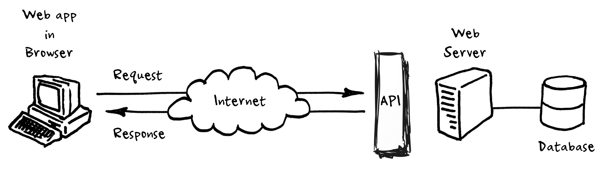
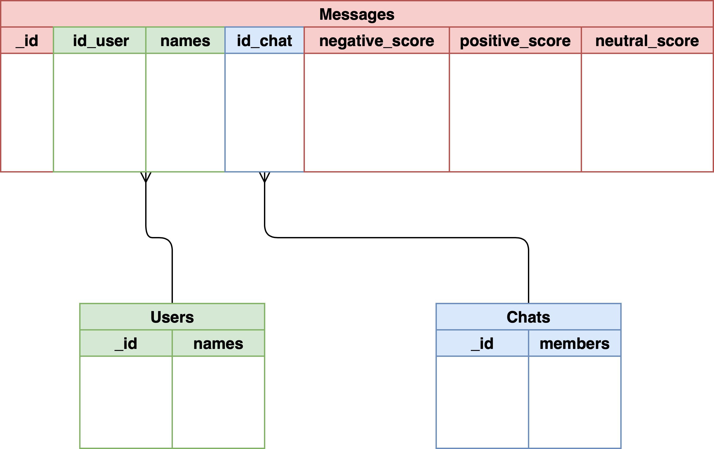

# Api-Creation

 

## Scope:

The aim of this project is to create an api of chat messages, to later analyze the conversations. Functionalities:

- It stores chat messages in a cloud database ✅
- It extracts sentiments from chat messages ✅
- It recommends friends to a user based on the contents from chat messages using a recommender system with `NLP` analysis ✅
- The service is deployed with Docker to Heroku.

## Design of the API

- Cloud DB: `MongoATLAS`
- Flask 

## Database Schema Implemented:

 

